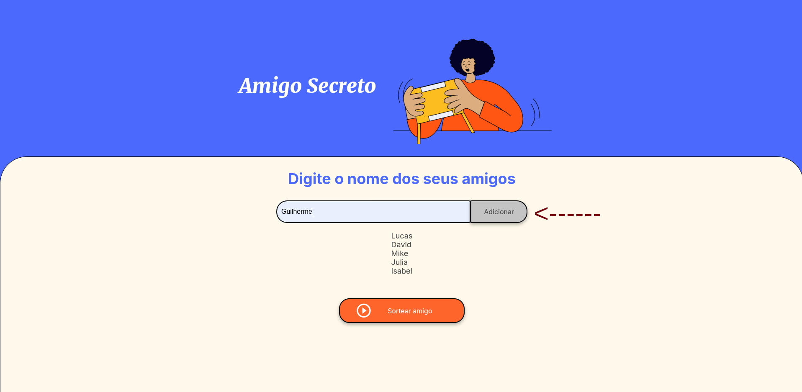
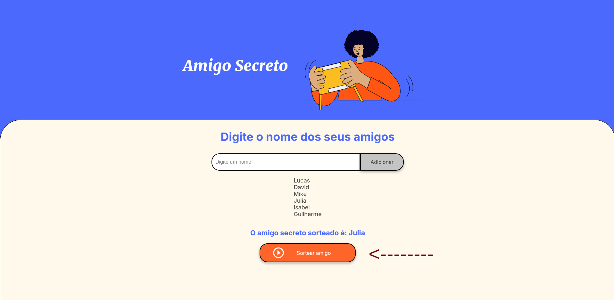

# Amigo Secreto

O projeto "Amigo Secreto" permite que você sorteie amigos de forma simples e divertida, ideal para grupos que desejam realizar uma troca de presentes de forma anônima. O sistema permite que você insira os nomes de seus amigos, faça o sorteio e visualize os resultados de forma prática.


## Funcionalidades

- **Adição de Amigos**: Você pode adicionar o nome de seus amigos para participar do sorteio.
- **Sorteio Automático**: Após adicionar os nomes, é possível sortear os amigos secretos com um simples clique.
- **Resultados Instantâneos**: O sistema exibe os resultados do sorteio, mostrando quem tirou quem.

## Tecnologias Utilizadas

- **HTML5**: Estrutura da página.
- **CSS3**: Estilo da interface.
- **JavaScript**: Lógica do sorteio e manipulação dos dados inseridos.

## Como Usar

1. **Clone o repositório**:
    ```bash
    git clone https://github.com/marcio-lsantos/challenge-amigo-secreto_pt-main.git
    ```

2. **Abra o arquivo `index.html` em seu navegador** para começar a usar a aplicação.

3. **Adicione os nomes dos seus amigos** utilizando o campo de texto e o botão "Adicionar". 

   

4. **Clique em "Sortear amigo"** para gerar os pares de amigo secreto. Os resultados serão exibidos abaixo.

   

## Estrutura de Arquivos

- `index.html`: Arquivo principal com a estrutura HTML da página.
- `style.css`: Arquivo de estilos para a formatação visual.
- `app.js`: Arquivo JavaScript que contém a lógica do sorteio.

